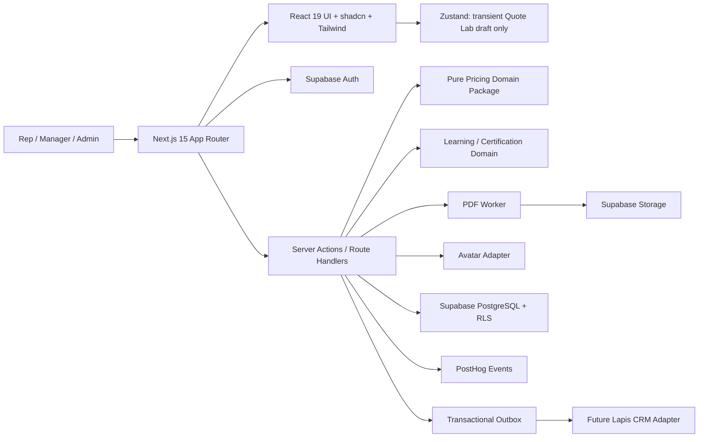

# Mercurius University - Phase 1 Technical Blueprint

**Status:** Implementation-ready planning baseline  
**Date:** July 15, 2026  
**Priority order:** 1) Quote Lab and pricing correctness, 2) New Hire Ramp Path, 3) supporting Phase 1 capabilities

## 1. Executive decisions

Phase 1 should be built as a modular monolith in one Next.js 15 application, backed by Supabase PostgreSQL/Auth/Storage. Quote calculations live in a pure, dependency-free TypeScript domain package and run identically in the browser preview, server save path, PDF generation, and tests. The server is always authoritative.

The New Hire Ramp Path is a data-driven learning workflow, not hard-coded pages. Weeks, days, requirements, unlock rules, assessments, and source-document versions are stored as content records. This lets leadership update training without redeploying the application while keeping certification evidence auditable.

### Source precedence

1. The locked July 15, 2026 PRD controls scope, calculation order, certification, and Phase 1 behavior.
2. The June 30, 2026 Pricing Reference Sheet controls current package prices, enhancement prices, and discount percentages.
3. The Enhancement Match Guide controls pain-to-enhancement recommendations and scripts.
4. The April 2026 Sales Rep Onboarding Guide controls Week 1-4 activities, targets, and daily rhythm.

The onboarding guide has an older pricing/bundle table. It must not seed Quote Lab. Every saved quote stores its pricing-catalog version and an immutable calculation snapshot.

### Clarifications encoded in this blueprint

- Discounts apply to enhancement lines, not the selected core package price.
- Software line discount is additive `tier + bundle`, capped at 38% per line. This makes the documented 38% cap operative: Intelligence Pro (20%) plus a four-item bundle (20%) becomes 38%, not 40%.
- All selected non-Ads service enhancements count toward the software bundle threshold but never receive the bundle discount.
- Ads Command is exempt from every discount and from the bundle count. Counting it would indirectly create a discount, contradicting “fully exempt.”
- Ad spend is a vendor pass-through: included in the vendor monthly total, but not discounted and not commissionable. This is the only material business interpretation that should receive leadership confirmation before production launch.
- Money is integer cents; discounts are integer basis points; each line rounds half-up to the nearest cent before totals are summed.
- Residual is 10% of commissionable monthly recurring revenue and begins in Month 2. “Year 1 estimate” means upfront commission plus 12 residual payments, matching the PRD formula even though the first payment starts in Month 2.
- Nexus requires manager-entered custom prices and approval; it never inherits an undocumented discount.

## 2. Technical architecture



### Runtime boundaries

- **Client:** accessible UI, draft form state, optimistic navigation, practice timers, and calculation preview. No authorization or final pricing authority.
- **Server:** validates input with Zod, loads the active catalog, recalculates, persists snapshot atomically, generates signed PDF URLs, evaluates unlocks, and emits analytics/outbox events.
- **Domain:** pure TypeScript functions with no React, database, time, network, or environment dependencies. Inputs and output are serializable.
- **Data:** PostgreSQL constraints and RLS enforce tenant and role isolation. Pricing and source versions are immutable after activation.
- **Integrations:** Avatar, PostHog, storage, and future CRM sit behind ports/adapters so their failures do not corrupt quote or learning transactions.

### Recommended repository shape

```text
apps/web/
  app/                       # App Router routes and layouts
  components/                # Route-level and shared UI
  features/quote-lab/        # Quote UI, form schema, draft store
  features/ramp/             # Learning UI and progress actions
  lib/auth/                  # session, RBAC, RLS helpers
  lib/supabase/              # browser/server/admin clients
  lib/analytics/             # typed event facade
  lib/integrations/          # avatar, PDF, CRM adapters
packages/domain/
  pricing/                   # calculateQuote, types, validation
  learning/                  # unlock and certification evaluators
  shared/                    # Money, Result, IDs, clocks
packages/db/
  migrations/                # SQL migrations and RLS policies
  seed/                      # versioned catalog + Ramp Path seed
packages/test-factories/     # deterministic builders
```

### Security and reliability

- Supabase email magic link or SSO; `profiles` is linked 1:1 to `auth.users`.
- Organization membership has `rep`, `manager`, or `admin`; authorization is checked server-side and with RLS.
- Reps read their own quotes, attempts, progress, and sessions. Managers read team records. Admins manage versioned content and catalogs.
- Live-quote create uses an idempotency key and a serializable transaction: load catalog, calculate, insert quote/lines/snapshot, append audit event.
- Never persist raw Avatar audio by default. Store transcript/scoring only with explicit retention settings.
- PDFs use short-lived signed URLs; vendor notes are escaped and excluded from analytics.
- Sentry/OpenTelemetry capture trace IDs; pricing logs contain catalog version and calculation hash, never vendor PII.
- Availability target: graceful degradation for PostHog and Avatar; Quote Lab save remains available. Client drafts persist locally for field connectivity and sync through an idempotent server action.

### Key service contracts

```ts
type CalculateQuote = (
  input: QuoteInput,
  catalog: PricingCatalog,
) => QuoteCalculation;

type EvaluateUnlock = (
  enrollment: EnrollmentSnapshot,
  node: LearningNode,
) => UnlockDecision;

interface AvatarGateway {
  createSession(input: AvatarSessionInput): Promise<{ sessionUrl: string }>;
  verifyScore(callback: SignedAvatarCallback): Promise<RolePlayScore>;
}
```

`calculateQuote` returns each line's list price, tier discount, bundle discount, applied discount, final price, discount reason, commissionable amount, totals, warnings, and a deterministic SHA-256 hash of canonical input + catalog version + output.

## 3. Next.js route and component tree

```text
app/
├─ (public)/login/page.tsx
├─ (app)/layout.tsx
│  ├─ AppShell
│  │  ├─ PrimaryNav
│  │  ├─ MobileNav
│  │  ├─ RepIdentityMenu
│  │  └─ GlobalCoachLauncher
│  ├─ dashboard/page.tsx
│  │  └─ DashboardScreen
│  │     ├─ TodayRampCard                 # highest-priority next action
│  │     ├─ QuickQuoteCard                # start practice/live quote
│  │     ├─ RampProgressRing
│  │     ├─ BronzeRequirementsCard
│  │     └─ EarningsSummary
│  ├─ quote-lab/page.tsx
│  │  └─ QuoteLabScreen
│  │     ├─ QuoteModeSwitch
│  │     ├─ VendorContextPanel
│  │     │  ├─ VendorIdentityFields
│  │     │  ├─ VendorPainCombobox
│  │     │  └─ MatchRecommendationCards
│  │     ├─ QuoteBuilder
│  │     │  ├─ CorePackageSelect
│  │     │  ├─ EnhancementPicker
│  │     │  │  ├─ SoftwareEnhancementGroup
│  │     │  │  ├─ ServiceEnhancementGroup
│  │     │  │  └─ SoftwareServiceRuleCallout
│  │     │  ├─ AdSpendField               # conditional on Ads Command
│  │     │  └─ VendorNotesField
│  │     ├─ CalculationPanel
│  │     │  ├─ VendorTotals
│  │     │  ├─ DiscountLineBreakdown
│  │     │  ├─ RepEarningsBreakdown
│  │     │  ├─ ResidualMonthTwoCallout
│  │     │  └─ MarginProtectionWarnings
│  │     └─ QuoteActions
│  │        ├─ SaveQuoteButton
│  │        ├─ GeneratePdfButton
│  │        └─ SubmitPracticeQuoteButton
│  ├─ quote-lab/[quoteId]/page.tsx
│  │  └─ SavedQuoteScreen
│  ├─ quote-lab/practice/[scenarioId]/page.tsx
│  │  └─ PracticeScenarioShell
│  │     ├─ ScenarioBrief
│  │     ├─ QuoteLabScreen
│  │     └─ PracticeResultDialog
│  ├─ ramp/page.tsx
│  │  └─ RampPathScreen
│  │     ├─ WeekTimeline
│  │     ├─ DailyTargetsCard
│  │     ├─ LearningNodeCard[]
│  │     └─ UnlockRequirementsSheet
│  ├─ ramp/[nodeId]/page.tsx
│  │  └─ LearningNodeScreen
│  │     ├─ LessonRenderer
│  │     ├─ KnowledgeCheck
│  │     ├─ AvatarRolePlayLauncher
│  │     ├─ QuotePracticeLauncher
│  │     └─ CompleteNodeAction
│  ├─ avatar/page.tsx
│  │  └─ AvatarZoneScreen
│  ├─ vault/page.tsx
│  │  └─ ContentVaultScreen
│  ├─ earnings/page.tsx
│  │  └─ BasicEarningsScreen
│  └─ profile/page.tsx
│     └─ RepProfileForm
├─ (manager)/approvals/page.tsx
│  └─ NexusApprovalQueue
├─ (admin)/content/page.tsx
│  └─ VersionedContentStudio
└─ api/
   ├─ quotes/[quoteId]/pdf/route.ts
   ├─ avatar/callback/route.ts
   └─ health/route.ts
```

Server Components load stable data. Client Components are limited to Quote Lab interaction, media/Avatar controls, quizzes, and animations. `quoteDraftStore` contains only unsaved form state; saved entities use server revalidation rather than a global client cache.

## 4. PostgreSQL database schema

All primary keys are UUID, all timestamps are `timestamptz`, and all mutable tables include `created_at`, `updated_at`, and optimistic `version` where relevant.

### Identity and tenancy

- `organizations(id, name, slug, settings_json)`
- `profiles(id -> auth.users.id, display_name, email, phone, avatar_url, timezone)`
- `organization_memberships(id, organization_id, profile_id, role, manager_membership_id, status, joined_at)`; unique `(organization_id, profile_id)`

### Versioned pricing and recommendations

- `pricing_catalogs(id, organization_id, code, version, status, effective_from, effective_to, source_document, checksum, activated_by)`; unique `(organization_id, code, version)`; activated rows immutable
- `catalog_products(id, catalog_id, code, name, product_kind, enhancement_class, setup_cents, monthly_cents, custom_pricing, sort_order, active)`; `product_kind in ('core','enhancement')`; `enhancement_class in ('software','service','ads',null)`
- `tier_discount_rules(id, catalog_id, core_product_id, software_bps, service_cap_bps)`
- `bundle_discount_rules(id, catalog_id, minimum_count, discount_bps)`
- `catalog_policies(catalog_id, max_line_discount_bps, upfront_commission_bps, residual_bps, ads_counts_for_bundle, ad_spend_commissionable, rounding_mode)`
- `vendor_pains(id, catalog_id, code, label, say_this, sort_order)`
- `pain_recommendations(pain_id, product_id, rank, rationale)`

Seed version `2026-06-30` with core prices, eight enhancements, tier rules, bundle thresholds, 38% cap, 25% setup commission, and 10% residual from the Pricing Reference Sheet.

### Quote Lab

- `vendors(id, organization_id, owner_membership_id, display_name, category, contact_name, email, phone, fictional, metadata_json)`
- `practice_scenarios(id, organization_id, content_version_id, title, brief, vendor_json, expected_catalog_id, expected_input_json, expected_calculation_hash, difficulty, active)`
- `quotes(id, organization_id, rep_membership_id, vendor_id, practice_scenario_id, mode, status, catalog_id, idempotency_key, notes, currency, setup_total_cents, monthly_total_cents, commissionable_mrr_cents, upfront_commission_cents, monthly_residual_cents, year_one_earnings_cents, calculation_hash, submitted_at, approved_at, approved_by)`; unique `(rep_membership_id, idempotency_key)`
- `quote_lines(id, quote_id, product_id, line_kind, quantity, list_setup_cents, list_monthly_cents, tier_discount_bps, bundle_discount_bps, applied_discount_bps, final_setup_cents, final_monthly_cents, commissionable_monthly_cents, reason_code, sort_order)`
- `quote_calculation_snapshots(quote_id primary key, engine_version, catalog_version, canonical_input_json, canonical_output_json, source_checksum)`; immutable
- `quote_pdfs(id, quote_id, storage_path, template_version, content_hash, generated_at)`
- `quote_approvals(id, quote_id, requested_by, assigned_to, status, reason, decision_note, decided_at)`
- `practice_attempts(id, scenario_id, rep_membership_id, quote_id, attempt_number, score, perfect, feedback_json, completed_at)`

Constraints: practice quotes require a scenario; live quotes require a non-fictional vendor; ad-spend lines require Ads Command; submitted/approved quote snapshots cannot be updated; Nexus/custom lines require an approved quote approval.

### Training, progress, and certification

- `content_versions(id, organization_id, code, version, status, source_document, checksum, published_at)`
- `learning_paths(id, content_version_id, code, title, description, certification_code, sort_order)`
- `learning_nodes(id, path_id, parent_node_id, node_type, code, title, week_number, day_start, day_end, estimated_minutes, required, sort_order, content_json)`
- `learning_prerequisites(node_id, prerequisite_node_id, rule_type, minimum_score)`
- `enrollments(id, path_id, rep_membership_id, status, started_at, target_completion_at, completed_at)`; unique `(path_id, rep_membership_id)`
- `node_progress(id, enrollment_id, node_id, status, percent, best_score, attempts, started_at, completed_at, evidence_json)`; unique `(enrollment_id, node_id)`
- `assessment_attempts(id, node_id, rep_membership_id, attempt_number, answers_json, score, passed, grading_version, completed_at)`
- `avatar_sessions(id, node_id, rep_membership_id, scenario_code, provider_session_id, status, transcript_path, score, scoring_json, consented_at, completed_at)`
- `certification_definitions(id, content_version_id, code, title, rules_json, badge_asset_path)`
- `certifications(id, definition_id, rep_membership_id, status, evidence_snapshot_json, issued_at, expires_at, revoked_at)`

Bronze `rules_json` requires: Ramp Path complete, at least three perfect practice quotes, and a verified Avatar role-play score of at least 80.

### Earnings, content, and operations

- `commission_ledger(id, organization_id, rep_membership_id, quote_id, entry_type, amount_cents, earned_at, payable_at, status, metadata_json)`
- `content_assets(id, content_version_id, title, asset_type, storage_path, extracted_text, search_vector, audience, sort_order)`
- `audit_events(id, organization_id, actor_profile_id, entity_type, entity_id, action, before_json, after_json, trace_id, occurred_at)`
- `outbox_events(id, organization_id, topic, aggregate_id, payload_json, attempts, available_at, processed_at, last_error)`

Indexes: quote history on `(organization_id, rep_membership_id, created_at desc)`, ramp dashboard on `(enrollment_id, status)`, manager views on `(organization_id, status, created_at desc)`, GIN on vault `search_vector`, unique Avatar provider session ID, and partial outbox index where `processed_at is null`.

## 5. Quote calculation specification

### Current catalog values

Core setup/monthly: Free `$0/$0`; Spark `$999/$99`; Spark Pro `$1,500/$399`; Insight `$2,500/$599`; Intelligence `$4,500/$999`; Intelligence Pro `$6,500/$1,499`; Nexus custom.

Software MRR: AI Marketing Co-Pilot `$149`; Visibility Accelerator `$179`; Retention Engine `$179`; Lead Velocity `$249`.

Service MRR: Social Command `$299`; Video Velocity `$597`; Content Command Suite `$797`; Ads Command `$1,497` plus ad spend.

Software tier discounts: Free `0%`, Spark `5%`, Spark Pro `10%`, Insight `12%`, Intelligence `18%`, Intelligence Pro `20%`. Service caps: Free `0%`; Spark, Spark Pro, and Insight `10%`; Intelligence `12%`; Intelligence Pro `15%`. Bundle: 0-1 count `0%`, 2 `10%`, 3 `15%`, 4+ `20%`. Maximum line discount `38%`.

### Deterministic algorithm

1. Validate catalog, unique products, nonnegative ad spend, Ads dependency, and custom-price approval.
2. Set `bundleCount` to selected software + selected non-Ads service enhancements.
3. Resolve bundle basis points from the threshold table.
4. Core line: no discount.
5. Software line: `min(tierBps + bundleBps, 3800)`.
6. Non-Ads service line: `min(serviceCapBps, 3800)`; bundle displayed as zero.
7. Ads Command and ad spend: zero discount.
8. Calculate and half-up round every line in cents; sum lines after rounding.
9. `upfront = roundHalfUp(core/final setup total * 25%)`.
10. `commissionableMrr = monthly total - ad spend`; `residual = roundHalfUp(commissionableMrr * 10%)`; `yearOne = upfront + 12 * residual`.
11. Emit a soft warning for no enhancements, a Month 2 residual callout, and line-level explanation codes.

## 6. Exact unit-test matrix

The compile-ready Vitest suite is delivered separately as `discount-engine.test.ts`. Its public contract is:

```ts
calculateQuote(input, PRICING_2026_06_30) -> QuoteCalculation
```

Mandatory golden cases:

| Case | Exact expected outcome |
|---|---|
| Spark + AI Co-Pilot | AI `14,155`; setup `99,900`; MRR `24,055`; upfront `24,975`; residual `2,406`; year one `53,847` cents |
| Spark + AI + Visibility | 15% each: `12,665` + `15,215`; total MRR `37,780`; residual `3,778` |
| Spark Pro + AI + Video | AI gets 20% (`11,920`); Video gets 10% (`53,730`); total MRR `105,550` |
| Insight + AI + Social + Video | AI gets 27% (`10,877`); services get 10%; total MRR `151,417` |
| Intelligence Pro + all four software | every software line capped at 38%; enhancement MRR `46,872`; total MRR `196,772` |
| Intelligence + AI + three non-Ads services | AI gets 38%; services get 12%; total MRR `258,122` |
| Intelligence Pro + Ads + $2,000 ad spend | Ads/ad spend undiscounted; vendor MRR `499,600`; commissionable MRR `299,600`; residual `29,960` |
| Intelligence Pro + AI + Ads | Ads does not unlock bundle; AI gets tier-only 20%; with $500 ad spend total MRR `361,520` |
| Spark core only | valid with warning; setup `99,900`; MRR `9,900` |
| Invalid inputs | reject duplicate product, ad spend without Ads, negative ad spend, unknown catalog code, and Nexus without custom approval |

The suite also verifies line-order invariance, catalog immutability, integer-only output, correct classification/reason codes, the 38% per-line cap, and server recomputation matching preview.

## 7. Phase 1 user stories

### Epic QL - Quote Lab (P0)

- **QL-01:** As a rep, I can select one current core package so that setup and base MRR are correct.
- **QL-02:** As a rep, I can select grouped software/service enhancements and always see the rule reminder.
- **QL-03:** As a rep, I receive a real-time, line-level discount explanation so I can confidently explain price.
- **QL-04:** As Mercurius, every line is calculated from the active versioned catalog with the 38% margin cap.
- **QL-05:** As a rep, I can add ad spend only with Ads Command and see pass-through vs commissionable MRR.
- **QL-06:** As a rep, I can see setup, monthly recurring, upfront commission, monthly residual, Year-1 estimate, and Month 2 callout.
- **QL-07:** As a rep, I can create a core-only quote after acknowledging a soft attach warning.
- **QL-08:** As a rep, I can choose a vendor pain and see Match Guide recommendations and “Say This” copy.
- **QL-09:** As a rep, I can save a live quote idempotently and retrieve its immutable calculation breakdown.
- **QL-10:** As a rep, I can generate a branded PDF populated from my editable profile.
- **QL-11:** As a trainee, I can complete fictional practice scenarios and receive exact accuracy feedback.
- **QL-12:** As a manager, I can approve Nexus/custom-price quotes before they become final.

### Epic RP - New Hire Ramp Path (P0)

- **RP-01:** As a new rep, I am automatically enrolled in the four-week Ramp Path with a clear next action.
- **RP-02:** As a rep, I can complete Day 1-2 product deep dive, ride-along simulation, Match Guide, and software/service lessons.
- **RP-03:** As a rep, I can complete Day 3 territory/list-building tasks and record evidence.
- **RP-04:** As a rep, I can practice the 15-second opener, 90-second pitch, pain match, and first outreach on Days 4-5.
- **RP-05:** As a rep, I can follow Week 2's daily rhythm and track 50-75 outreach attempts, 4-6 demos, and pipeline outcomes.
- **RP-06:** As a rep, Week 3 directs me into Quote Lab practice and first-close activities.
- **RP-07:** As a rep, Week 4 tracks three qualified deals, 10-15 book vendors, and at least $3,000 new revenue.
- **RP-08:** As a rep, prerequisites and pass scores clearly explain why a node is locked and how to unlock it.
- **RP-09:** As a rep, progress survives devices and resumes at the exact unfinished node.
- **RP-10:** As leadership, I can publish a new content version without rewriting historical completion evidence.
- **RP-11:** As a rep, I earn Bronze only after Ramp completion, three perfect practice quotes, and verified Avatar score >=80.

### Supporting Phase 1 stories (P1)

- **AU-01:** A user can authenticate and sees only organization-authorized data.
- **AV-01:** A rep can start a guided Avatar role-play and receive verified scoring/feedback.
- **CV-01:** A rep can search and open the current Pricing Sheet, Match Guide, and Onboarding Guide.
- **DB-01:** The dashboard prioritizes today's ramp task and starting/resuming a quote.
- **ER-01:** A rep sees basic earnings projections and saved-quote economics without treating projections as paid ledger entries.
- **AN-01:** Product events measure quote duration/accuracy, attach rate, lesson completion, and Bronze conversion without vendor PII.
- **MO-01:** Quote Lab and Ramp Path meet WCAG 2.2 AA fundamentals and work at 360px width.

## 8. Sprint 1 backlog - prioritized

**Sprint goal:** Establish a trustworthy pricing spine and let a new rep enter the first Ramp Path experience. Suggested two-week capacity: 40 story points. Items 1-9 are the committed slice (38 points); 10-13 are ordered stretch/next work.

| Rank | Ticket | SP | Acceptance criteria / evidence | Depends on |
|---:|---|---:|---|---|
| 1 | QL-ENG-01 Pure pricing domain types + Money | 3 | Integer cents/bps; Zod input; no framework imports; duplicate/invalid dependency errors | - |
| 2 | QL-ENG-02 Seed catalog `2026-06-30` | 3 | Exact seven cores/eight enhancements/rules; checksum; immutable active version | 1 |
| 3 | QL-ENG-03 Calculation engine | 8 | Implements ordered rules, classifications, half-up rounding, explanations, warnings, earnings, calculation hash | 1,2 |
| 4 | QL-QA-01 Golden pricing tests | 5 | All golden/negative cases in delivered test suite pass; mutation test on cap/classification killed | 3 |
| 5 | QL-DB-01 Quote schema + RLS + idempotent save | 5 | Rep isolation proven; snapshot atomic/immutable; retry creates one quote; server recalculates | 2,3 |
| 6 | QL-UI-01 Quote Lab selection shell | 5 | Core select; grouped enhancements; rule reminder; responsive 360px; keyboard operable | 1,2 |
| 7 | QL-UI-02 Live calculation/earnings panel | 3 | Exact line explanations/totals; residual Month 2; core-only warning; client/server parity | 3,6 |
| 8 | RP-DB-01 Learning content/progress schema | 3 | Versioned path/node/prerequisite/enrollment/progress tables; RLS tests | - |
| 9 | RP-SEED-01 Week 1 Ramp seed | 3 | Day 1-2, Day 3, Day 4-5 activities and Friday outcomes match onboarding source; next-action query works | 8 |
| 10 | RP-UI-01 Ramp overview + next action | 5 | Week timeline, locks, progress, resume behavior, mobile layout | 8,9 |
| 11 | QL-UI-03 Vendor pain recommendations | 3 | Five pains map to verified Match Guide products/scripts; no stale-catalog recommendation | 2,6 |
| 12 | QL-ENG-04 Practice scenario grading | 5 | Canonical answer hash; line-level feedback; perfect-attempt persistence; retry behavior | 3,5 |
| 13 | CI-01 Quality gates | 3 | PR runs typecheck, lint, unit, DB/RLS tests, accessibility smoke, and pricing coverage threshold | 4,5 |

### Definition of done for every Sprint 1 ticket

- Acceptance tests are automated where feasible; pricing behavior has no snapshot-only assertions.
- Server authorization and RLS tests exist for any new table/action.
- Keyboard, focus, empty/error/loading states, and 360px layout are verified for UI work.
- Analytics events use the typed event catalog and contain no vendor notes/contact data.
- Migration, rollback note, seed/checksum, and source version are reviewed.
- Product owner reviews any pricing interpretation change; changing a golden expected value requires a new catalog version or approved rules decision.

## 9. Phase 1 delivery sequence and gates

1. **Pricing spine (Week 1):** domain package, current catalog seed, golden tests, quote persistence.
2. **Usable Quote Lab (Weeks 1-2):** builder, explanations, earnings, vendor pain, practice grading.
3. **Ramp foundation (Weeks 1-2):** content model, Week 1 seed, progress/resume, dashboard next action.
4. **Ramp Weeks 2-4 + Bronze (Weeks 3-4):** activity targets, Avatar evidence, Quote Lab gates, certification evaluator.
5. **Phase 1 completion (Weeks 4-6):** PDF, Vault, basic earnings, polish, security/a11y/performance QA.

Release gates: all golden tests pass; no unresolved P0/P1 security issues; quote save is idempotent; saved quote reproduces from its snapshot; three representative mobile quote journeys complete in under 90 seconds; Bronze cannot be issued without all three evidence classes; current content and pricing version are visible to admins.

## 10. Required product-owner confirmation

Confirm before production, without blocking Sprint 1 implementation:

1. Ad spend is pass-through and excluded from residual commission.
2. Ads Command does not count toward software bundle thresholds because it is “exempt from everything.”
3. Software discounts are additive before the 38% line cap, not multiplicatively compounded.
4. Free has 0% tier/service discount; Nexus requires custom approved rules.
5. The June 30 Pricing Reference Sheet supersedes the April onboarding pricing/bundle tables.

Each is isolated in versioned catalog policy data or a tested engine rule, so a confirmed change is explicit and auditable.

## 11. Source register

- Mercurius University PRD v1.0, July 15, 2026 (locked scope authority)
- Mercurius Pricing Reference Sheet, June 30, 2026 (pricing authority; marked tentative pending delivery-cost verification)
- Mercurius Enhancement Match Guide, June 30, 2026 (pain matching authority)
- Mercurius Sales Rep Onboarding Guide, April 2026 (Ramp Path activity authority; legacy pricing excluded)

